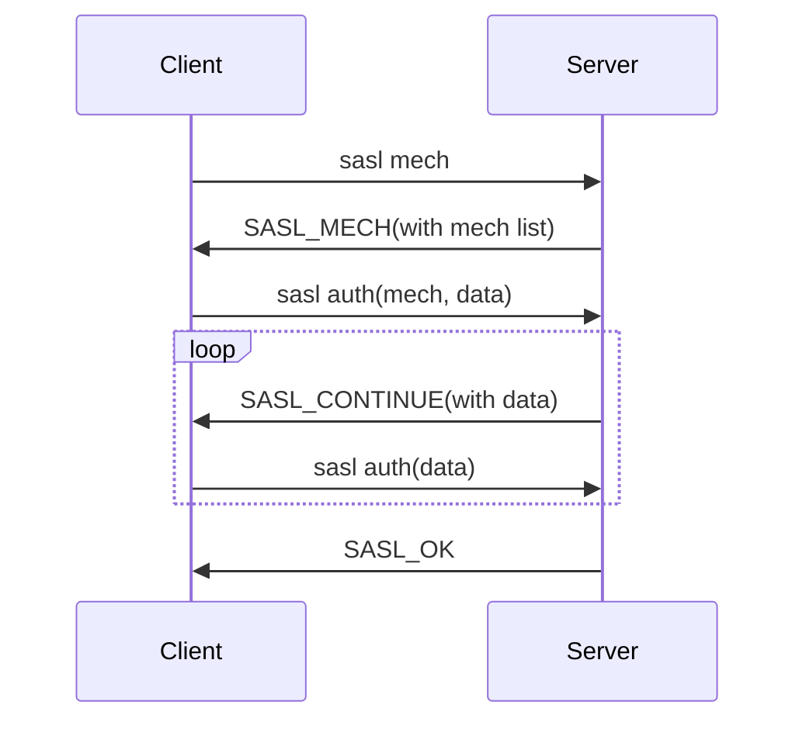

# Chapter 12. SASL 명령

SASL 인증에 관한 명령은 아래와 같다.

- [sasl mech](#sasl-mech)
- [sasl auth](#sasl-auth)

## sasl mech

캐시 서버에서 지원하는 인증방식 목록을 조회한다.

```
sasl mech\r\n
```

성공 시의 response string은 아래와 같다. 구동 방식에 따라 일부 인증 방식만 사용 가능하도록 제한될 수 있다.

```
SASL_MECH SCRAM-SHA-512 SCRAM-SHA-384 SCRAM-SHA-256 SCRAM-SHA-224 SCRAM-SHA-1 GS2-KRB5 GS2-IAKERB GSSAPI GSS-SPNEGO DIGEST-MD5 OTP CRAM-MD5 PLAIN ANONYMOUS\r\n
```
```
SASL_MECH SCRAM-SHA-256\r\n
```

실패 시의 response string과 그 의미는 아래와 같다.
| Response String | 설명 |
| - | - |
| "NOT_SUPPORTED" | SASL 인증 기능이 off 상태 |
| "ERROR" | SASL 인증 기능이 disable 상태 |
| "CLIENT_ERROR bad command line format" | protocol syntax 틀림 or SASL 인증 기능이 disable 상태 |

## sasl auth

주어진 인증 방식에 따라 인증 과정을 수행한다. 인증 방식 인자의 포함 여부에 따라 새로운 인증 과정 시작(start)인지, 이전 인증 요청을 이어서 수행(step)하는 것인지 구분한다.

1. start: 클라이언트가 선택한 인증 방식으로 인증 과정을 시작한다.

```
sasl auth <mech> <bytes>\r\n
<data>\r\n
```

2. step: 이전 sasl auth 명령에서 ARCUS Cache Server가 `SASL_CONTINUE`를 응답한 경우, 추가 데이터를 전달한다.

```
sasl auth <bytes>\r\n
<data>\r\n
```

성공 시의 response string은 아래와 같다.
```
SASL_OK\r\n
```
여러 단계로 구성된 인증 방식(SCRAM)의 경우 서버는 인증에 필요한 추가 데이터를 요청할 수 있다. 클라이언트는 서버가 전달한 값을 바탕으로 `SASL_OK` 응답(또는 실패 응답)을 수신할 때까지 step 명령을 전송해야 한다.
```
SASL_CONTINUE <bytes>\r\n
<data>\r\n
```

실패 시의 response string과 그 의미는 아래와 같다.
| Response String | 설명 |
| - | - |
| "NOT_SUPPORTED" | SASL 인증 기능이 off 상태 |
| "AUTH_ERROR" | 지원하지 않는 인증 방식 or username/password 틀림 |
| "ERROR" | SASL 인증 기능이 disable 상태 |
| "CLIENT_ERROR bad command line format" | protocol syntax 틀림 |
| "SERVER_ERROR out of memory" | 메모리 부족 |

## Authentication flow



1. (optional) `sasl mech` 명령 전송하여 서버가 지원하는 인증 방식 확인
2. 적절한 인증 방식 선택하여 `sasl auth`(start) 명령 전송
3. `SASL_CONTINUE` 응답 수신 시 인증에 필요한 다음 값 계산하여 `sasl auth`(step) 명령 전송
4. 인증 성공(`SASL_OK`) 또는 실패(`AUTH_ERROR`)
